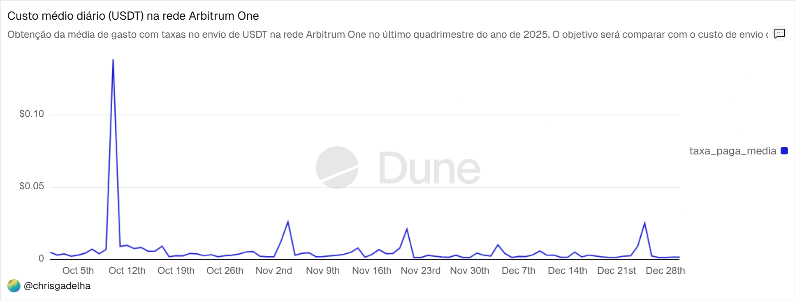
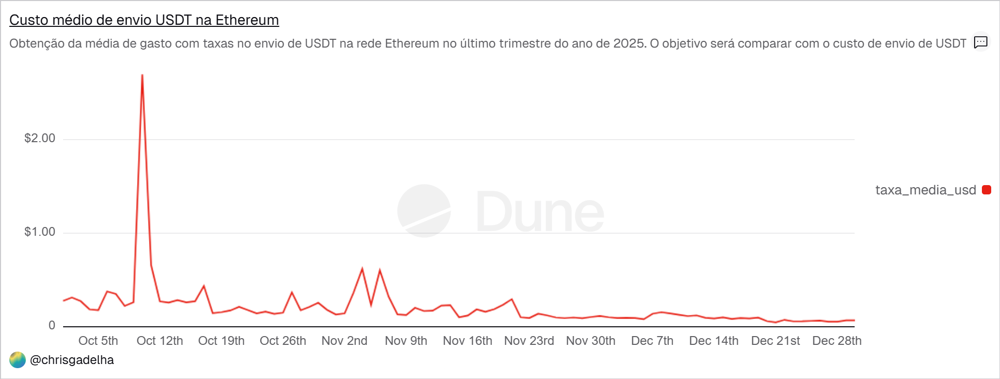

# 📊 Arbitrum vs. Ethereum: Análise de Eficiência de Custos na transação de USDT (Q4 2025)

> **Autor:** [Christian Gadelha | Economista & Embaixador Arbitrum
> **Ferramenta:** Dune Analytics

## 🎯 Objetivo do Projeto
Como economista, meu foco é analisar a eficiência de mercado e a redução de custos de transação. Este projeto visa comparar o custo real de envio de USDT  entre as redes Arbitrum One e a Ethereum Mainnet.

O estudo foca no **4º Trimestre de 2025 (Out-Dez)**, e será utilizado posteriormente para comparar com as taxas cobradas no sistema bancário tradicional (SWIFT).

## 🗂️ Metodologia e Queries
Utilizei SQL para extrair dados brutos das tabelas de transação (`transactions`) e cruzei com a tabela de preços (`prices.usd`) minuto a minuto.

* **Query 1 (Arbitrum):** Focada na eficiência. Utiliza `effective_gas_price` para precisão máxima de custos L2.
* **Query 2 (Ethereum):** Focada no *benchmark* de custo. Utiliza `gas_price` para mensurar o custo da segurança na L1.

As queries completas estão disponíveis na pasta [`/queries`](./queries).

## 📉 Principais Insights

### 1. A Disparidade de Custo
Os dados mostram que a Arbitrum reduz o custo de transação em mais de **95-99%** em comparação à Ethereum, transformando taxas de Dólares em centavos.

### 2. O "Teste de Estresse" (10 de Outubro de 2025)
Identifiquei um pico de volatilidade na rede no dia 10/Out, que serviu como prova de resiliência econômica:
* 🔴 **Ethereum (L1):** A taxa média disparou para **~$2.69 USD**.
* 🔵 **Arbitrum (L2):** Sob a mesma pressão, a taxa média foi de apenas **~$0.13 USD**.

**Obs:** Não é objetivo agora falar o que aconteceu neste dia, mas resumindo houve uma queda brusca do Bitcoin e da Ethereum, o que levou a muitos movimentos na rede.
**Conclusão:** Mesmo no pior cenário de congestionamento, a Arbitrum manteve-se **20x mais barata** que a camada base e **~150x mais barata** que uma remessa bancária tradicional ($20+).

## 📊 Visualização
Abaixo, o comparativo visual gerado no Dune Analytics:

## 🔗 Links do Dashboard completo do Dune
* [Acessar Dashboard Interativo no Dune](https://dune.com/chrisgadelha/custos-envio-usdt-arbitrum-l2-vs-ethereum-l1-q4-2025?utm_source=share&utm_medium=copy&utm_campaign=dashboard)

---
*Este repositório faz parte do meu portfólio como Analista de Dados Web3.*
